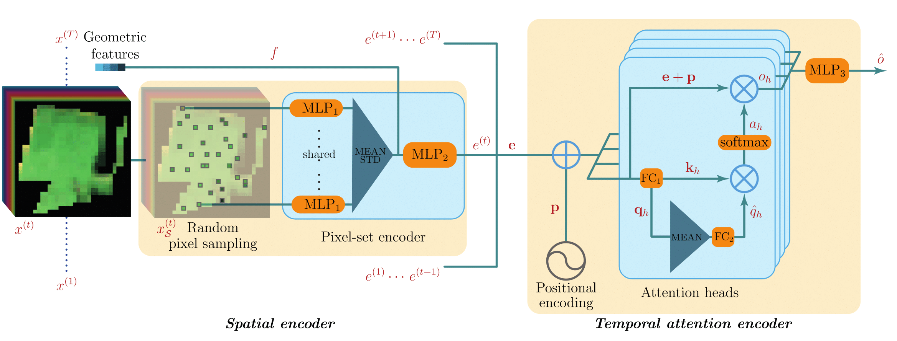

# PSE-TAE 遥感影像时空分类模型复现

  本仓库为课程作业项目，围绕 CVPR 2020 论文 **Satellite Image Time Series Classification with Pixel-Set Encoders and Temporal Self-Attention** 进行代码复现、训练验证与结果可视化。项目基于 PSE（Pixel-Set Encoder）与 TAE（Temporal Attention Encoder）架构，面向 Sentinel-2 卫星影像时间序列数据开展地物分类实验，重点验证该模型在遥感影像时空分类任务中的有效性、稳定性与可复现性。
## 小组成员信息

| 角色 | 姓名 | 学号 |
| --- | --- | --- |
| 组长 | 王少艺 | 2025303120175 |
| 组员 | 余娟 | 2025303110117 |
| 组员 | 丁红俊 | 2025303110115 |

## 参考论文信息
* 论文名称：Satellite Image Time Series Classification with Pixel-Set Encoders and Temporal Self-Attention
* 论文会议：CVPR 2020 Oral
* 论文 DOI：10.1109/CVPR42600.2020.01233
* 论文链接：https://openaccess.thecvf.com/content_CVPR_2020/html/Garnot_Satellite_Image_Time_Series_Classification_With_Pixel-Set_Encoders_and_Temporal_CVPR_2020_paper.html
* 原始代码仓库：https://github.com/VSainteuf/pytorch-psetae

> 说明：本仓库是在原始开源项目基础上的课程复现版本，主要补充了环境配置、训练过程验证、推理结果输出、指标统计和可视化分析等内容。

---

## 1. 项目简介

  遥感影像时间序列数据能够反映地物在不同时间节点上的光谱变化特征，是农业地块识别、土地覆盖分类和地表动态监测中的重要数据来源。传统卷积神经网络通常依赖规则影像块进行空间特征提取，而 Sentinel-2 等中分辨率遥感影像中，同一地块内部像元数量有限且空间排列不规则。PSE-TAE 模型通过 Pixel-Set Encoder 对无序像元集合进行空间特征编码，并利用 Temporal Attention Encoder 捕捉多时相观测之间的时间依赖关系，从而实现高效的遥感影像时空分类。

本复现项目主要完成以下工作：

1. 搭建 PSE-TAE 模型运行环境；
2. 准备 Sentinel-2 Pixel-Set 数据集；
3. 执行 5 折交叉验证训练；
4. 保存模型权重、训练日志、测试指标和混淆矩阵；
5. 基于训练日志与测试结果制作可视化图表；
6. 总结复现过程中遇到的依赖兼容与硬件适配问题。

---

## 2. 代码核心功能

本项目面向 Sentinel-2 遥感影像数据集的多类别地物分类任务，核心流程由 `train.py` 和 `inference.py` 两个主脚本构成。

### 2.1 模型结构

模型主要包括三个部分：

* **Pixel-Set Encoder, PSE**：对每个地块内部的像素集合进行编码，提取空间维度上的统计与聚合特征；
* **Temporal Attention Encoder, TAE**：基于自注意力机制建模多时相遥感观测之间的时间依赖关系；
* **MLP Classifier**：将时空特征映射到最终地物类别，实现多类别分类。

模型整体结构如下：



### 2.2 训练与推理流程

`train.py` 用于模型训练与验证，主要功能包括：

* 读取 Pixel-Set 数据集；
* 按照指定类别筛选样本；
* 执行 5 折交叉验证；
* 记录每轮训练损失、准确率和 IoU；
* 保存最优模型权重；
* 输出测试指标与混淆矩阵。

`inference.py` 用于模型推理，主要功能包括：

* 加载训练得到的模型权重；
* 对全量数据集进行批量预测；
* 输出样本 ID、真实标签和预测标签；
* 为后续分类结果分析和可视化提供数据支持。

---

## 3. 环境配置

本项目复现过程中主要使用 Python、PyTorch、torchnet、scikit-learn 等依赖库。由于原始项目发布时间较早，部分依赖与新版 PyTorch 存在兼容问题，因此建议按照固定版本配置环境。

### 3.1 推荐环境

```text
Python == 3.6.6
PyTorch == 1.1.0
CUDA == 10.0
torchnet
numpy
pandas
scikit-learn
tqdm
```

### 3.2 安装依赖

可以使用以下命令安装依赖：

```bash
pip install -r requirements.txt
```

如果使用 UV 管理环境，可根据 `requirements.txt` 创建一致的运行环境。

---

## 4. 数据来源

本项目使用原论文提供的 Pixel-Set 数据集。由于完整数据集体积较大，仓库中不直接包含 `data/` 文件夹。请用户根据需要自行下载数据，并放置到项目根目录下。

### 4.1 数据下载

原论文数据集下载地址如下：

* Pixel-Set dataset：https://zenodo.org/record/5815488
* Pixel-Patch dataset：https://zenodo.org/record/5815523
* Toy dataset：http://recherche.ign.fr/llandrieu/TAE/S2-2017-T31TFM-PixelSet-TOY.zip


下载完成后，请将数据解压到项目根目录下的 `data/` 文件夹中。

### 4.2 数据组织结构

数据文件夹建议组织如下：

```text
data/
├── normalisation_values.pkl
├── DATA/
│   ├── sample0.npy
│   ├── sample1.npy
│   └── ...
└── META/
    ├── labels.json
    ├── dates.json
    └── geomfeat.json
```

其中：

* `DATA/` 存储每个样本对应的 `.npy` 文件；
* `META/labels.json` 存储样本标签；
* `META/dates.json` 存储多时相观测日期；
* `META/geomfeat.json` 存储可选的几何或静态特征；
* `normalisation_values.pkl` 存储归一化所需的均值和标准差。

---

## 5. 仓库结构

本仓库主要文件结构如下：

```text
.
├── dataset.py              # 数据集读取与预处理
├── train.py                # 模型训练与交叉验证
├── inference.py            # 模型推理
├── requirements.txt        # 项目依赖
├── models/                 # PSE、TAE 和 PSE-TAE 模型结构
├── learning/               # 训练、损失函数和评价指标相关工具
├── preprocessing/          # 数据预处理脚本
├── graphics/               # 模型结构图及可视化图像
├── vis_resluts/            # 复现结果可视化图表
├── .gitignore              # 忽略数据集、模型权重和训练输出等大文件
└── README.md               # 项目说明文档
```

---

## 6. 运行步骤

### 6.1 训练模型

运行 `train.py` 进行模型训练：

```bash
python train.py --dataset_folder ./data
```

训练脚本将自动执行 5 折交叉验证，并在对应输出目录中保存训练日志、模型权重、测试指标和混淆矩阵。

### 6.2 模型推理

训练完成后，可以使用 `inference.py` 进行推理：

```bash
python inference.py --dataset_folder ./data --weight_dir ./results/Fold_1
```

其中，`--weight_dir` 为已训练模型权重所在文件夹。

### 6.3 结果输出

训练和推理完成后，主要输出文件包括：

```text
results/
├── Fold_1/
│   ├── trainlog.json
│   ├── test_metrics.json
│   ├── confusion_matrix.npy
│   └── model.pth.tar
├── Fold_2/
├── Fold_3/
├── Fold_4/
└── Fold_5/
```

---

## 7. 复现结果与可视化

本项目基于模型训练输出的核心数据文件制作了训练过程可视化图表和测试性能汇总图表，分别从模型收敛过程、验证集表现和独立测试集性能三个方面展示 PSE-TAE 模型的复现效果。实验结果主要包括两部分：一是 Fold1–Fold5 的训练与验证过程指标变化，二是 5 折模型在独立测试集上的 Accuracy、Loss 和 mIoU 指标汇总。

### 7.1 单折训练过程可视化

基于每折 `trainlog.json` 中记录的 epoch 级数据，分别绘制训练损失、验证损失、训练准确率、验证准确率、训练 IoU 和验证 IoU 随训练轮次变化的曲线，用于观察模型收敛过程和训练稳定性。

从 Fold1–Fold5 的训练曲线可以看出，模型在 1–10 个 epoch 内整体呈现较为稳定的收敛趋势。Loss 曲线方面，各折训练损失均在前几个 epoch 内快速下降，随后逐渐趋于平稳，验证损失也整体保持下降趋势，说明模型能够较快学习遥感影像时间序列中的有效分类特征。Accuracy 曲线方面，训练准确率随 epoch 增加逐步提升，最终基本稳定在 93%–94% 左右；验证准确率整体维持在较高水平，说明模型在验证集上具有较好的分类效果。IoU 曲线方面，训练 IoU 和验证 IoU 整体呈上升趋势，虽然验证 IoU 在部分 epoch 中存在小幅波动，但整体变化方向稳定，表明模型对不同地物类别的空间识别能力逐步增强。

综合来看，五折训练过程均表现出较好的收敛性和稳定性，没有出现明显的训练崩溃或异常震荡现象。


### 7.2 5 折测试指标汇总

基于各折 `test_metrics.json` 文件，统计模型在独立测试集上的 Accuracy、Loss 和 mIoU 指标。结果如下：

| Fold  | Test Accuracy (%) | Test Loss | Test mIoU |
| ----- | ----------------: | --------: | --------: |
| Fold1 |             94.11 |    0.1441 |    0.4505 |
| Fold2 |             93.66 |    0.1511 |    0.4342 |
| Fold3 |             94.02 |    0.1434 |    0.4494 |
| Fold4 |             94.04 |    0.1426 |    0.4508 |
| Fold5 |             93.82 |    0.1466 |    0.4490 |
| Mean  |             93.93 |    0.1456 |    0.4468 |

从测试结果可以看出，5 折实验的测试准确率范围为 **93.66%–94.11%**，平均测试准确率约为 **93.93%**。其中 Fold1 的测试准确率最高，为 94.11%；Fold2 的测试准确率最低，为 93.66%。不同折之间的准确率差异较小，说明模型在不同数据划分下具有较好的稳定性和泛化能力。

测试损失范围为 **0.1426–0.1511**，整体波动幅度较小。其中 Fold4 的测试损失最低，为 0.1426；Fold2 的测试损失最高，为 0.1511。该结果表明模型在各折测试集上的预测误差较为稳定。

测试 mIoU 范围为 **0.4342–0.4508**，平均值约为 **0.4468**。其中 Fold4 的 mIoU 最高，为 0.4508；Fold2 的 mIoU 最低，为 0.4342。该结果说明模型在不同类别的空间分类稳定性方面整体表现较好，但不同折之间仍存在一定差异。


### 7.3 综合评价指标

基于整体测试结果，模型的综合评价指标如下：

| 指标              |     数值 |
| --------------- | -----: |
| Accuracy        | 93.93% |
| micro IoU       | 88.55% |
| micro Precision | 93.93% |
| micro Recall    | 93.93% |
| micro F1-score  | 93.93% |
| macro IoU       | 44.75% |
| macro Precision | 76.12% |
| macro Recall    | 50.41% |
| macro F1-score  | 52.44% |

从综合评价结果来看，模型整体 Accuracy、micro Precision、micro Recall 和 micro F1-score 均达到 **93.93%**，说明 PSE-TAE 模型在总体样本层面具有较高的分类准确性。micro 指标主要反映整体样本分类效果，因此能够说明模型整体分类性能较好。

相比之下，macro 指标对每个类别进行平均计算，更能反映模型对不同类别的均衡识别能力。本实验中 macro IoU 为 **44.75%**，macro F1-score 为 **52.44%**，明显低于 micro 指标，说明模型虽然整体分类精度较高，但在部分类别上的识别效果仍存在差异。可能原因包括不同地物类别样本数量不均衡、部分类别光谱特征相近，以及不同类别之间的时间序列变化模式相似等。

### 7.4 结果分析

综合训练过程和测试结果可以看出，PSE-TAE 模型能够有效结合 Pixel-Set Encoder 的像元集合空间特征表达能力和 Temporal Attention Encoder 的时序特征建模能力，在 Sentinel-2 遥感影像时间序列分类任务中取得了较好的复现效果。

从训练过程来看，模型在前几个 epoch 内快速收敛，随后逐渐稳定，说明模型能够较快提取多时相遥感影像中的有效特征。从测试结果来看，五折实验的 Accuracy、Loss 和 mIoU 波动较小，表明模型在不同数据划分下具有较好的稳定性和泛化能力。

同时，macro 指标低于 micro 指标也说明模型在不同类别之间的识别能力仍不完全均衡。后续可以从类别样本均衡、训练轮次增加、损失函数优化、数据增强和类别权重调整等方面进一步改进模型表现。

总体而言，本项目较好地完成了 PSE-TAE 模型的代码复现、训练验证、指标统计和结果可视化，实验结果能够证明该模型在遥感影像时间序列分类任务中的有效性。

---


## 8. 成员分工

本课程复现项目由王少艺、余娟和丁红俊共同完成。项目围绕 PSE-TAE 遥感影像时空分类模型的论文理解、数据准备、环境配置、代码复现、模型训练、推理测试、结果可视化和 GitHub 仓库整理等环节展开。各成员具体分工如下。

| 角色 | 姓名  | 学号            | 主要分工                                                                                                                                                         |
| -- | --- | ------------- | ------------------------------------------------------------------------------------------------------------------------------------------------------------ |
| 组长 | 王少艺 | 2025303120175 | 负责项目整体技术路线设计与任务统筹；完成原始代码仓库梳理、核心脚本运行调试、模型训练与推理流程复现；负责 GitHub 仓库创建、代码上传、版本管理和大文件排除规则配置；负责 README 文档主体撰写、项目结构整理、运行步骤规范化、结果说明撰写和最终材料整合。 |
| 组员 | 余娟  | 2025303110117 | 负责原论文及相关资料查找，协助整理 PSE-TAE 模型的研究背景、论文来源、模型基本原理和引用信息；参与数据来源信息整理，协助确认 Pixel-Set 数据集、Pixel-Patch 数据集和 Toy 数据集的下载地址及数据说明，为 README 中“项目简介”和“数据来源”部分提供资料支撑。         |
| 组员 | 丁红俊 | 2025303110115 | 负责协助数据集下载与本地数据目录整理，参与检查数据文件结构和运行所需输入路径；协助记录环境配置、依赖安装过程和运行过程中出现的问题；参与训练结果、测试指标和可视化图表的辅助整理，为 README 中“环境配置”“运行步骤”和“结果说明”部分提供补充材料。        

---

## 9. 复现过程中遇到的问题及解决方法

### 9.1 torchnet 与新版 PyTorch 兼容问题

原始项目依赖的 torchnet 库与新版 PyTorch 存在部分接口不兼容问题，导致 `ClassErrorMeter` 等指标计算模块在训练过程中报错。复现过程中通过调整 PyTorch 版本并适配相关调用逻辑，保证训练指标能够正常统计。

### 9.2 CUDA 算力匹配问题

在不同设备上运行模型时，可能出现 CUDA 版本与 PyTorch 预编译版本不匹配的问题，例如：

```text
CUDA error: no kernel image is available for execution on the device
```

该问题可通过检查 GPU 算力、CUDA 版本和 PyTorch 版本之间的对应关系解决。建议按照推荐环境配置运行，避免由于硬件适配问题导致训练失败。

### 9.3 依赖版本精准性问题

部分 Python 包的新版接口与原始代码不完全兼容，例如 scikit-learn、tqdm 等。因此，复现过程中建议锁定依赖版本，并通过 `requirements.txt` 统一管理环境，减少不同设备之间的运行差异。

---

## 10. 注意事项

1. 本仓库不上传完整 `data/` 数据集，用户需要自行下载并放置到项目根目录下；
2. `results/`、`output/`、`runs/` 等训练输出文件夹默认不纳入 Git 管理；
3. `.pt`、`.pth`、`.npy`、`.npz`、`.pkl`、`.zip` 等大文件默认被 `.gitignore` 忽略；
4. 如需复现实验结果，请确保数据结构、依赖版本和运行参数与本文档保持一致。

---

## 11. 致谢与引用

本项目基于以下论文和开源仓库完成复现：

```bibtex
@inproceedings{garnot2020satellite,
  title={Satellite Image Time Series Classification With Pixel-Set Encoders and Temporal Self-Attention},
  author={Garnot, Vivien Sainte Fare and Landrieu, Loic and Giordano, Sebastien and Chehata, Nesrine},
  booktitle={Proceedings of the IEEE/CVF Conference on Computer Vision and Pattern Recognition},
  pages={12325--12334},
  year={2020}
}
```

原始代码仓库：

```text
https://github.com/VSainteuf/pytorch-psetae
```

本仓库仅用于课程学习、论文复现与实验验证。

